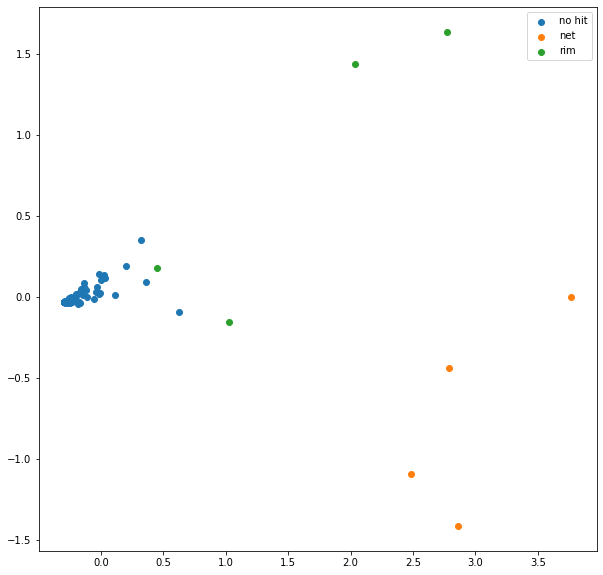

```python
import pandas as pd
import numpy as np
from matplotlib import pyplot as plt
```


```python
data  =pd.read_csv("logs/27-06-2021_172946.csv",index_col="TIMESTAMP",parse_dates=True)
data
```


<div>
<style scoped>
    .dataframe tbody tr th:only-of-type {
        vertical-align: middle;
    }

    .dataframe tbody tr th {
        vertical-align: top;
    }

    .dataframe thead th {
        text-align: right;
    }
</style>
<table border="1" class="dataframe">
  <thead>
    <tr style="text-align: right;">
      <th></th>
      <th>X</th>
      <th>Y</th>
      <th>Z</th>
      <th>ROLL</th>
      <th>PITCH</th>
      <th>YAW</th>
      <th>MILLIS</th>
    </tr>
    <tr>
      <th>TIMESTAMP</th>
      <th></th>
      <th></th>
      <th></th>
      <th></th>
      <th></th>
      <th></th>
      <th></th>
    </tr>
  </thead>
  <tbody>
    <tr>
      <th>2021-06-27 17:29:46.549496</th>
      <td>-0.889038</td>
      <td>-0.310913</td>
      <td>0.331543</td>
      <td>3.723145</td>
      <td>-4.028320</td>
      <td>-1.342773</td>
      <td>285748</td>
    </tr>
    <tr>
      <th>2021-06-27 17:29:46.638312</th>
      <td>-0.889038</td>
      <td>-0.310913</td>
      <td>0.331543</td>
      <td>3.723145</td>
      <td>-4.028320</td>
      <td>-1.342773</td>
      <td>285751</td>
    </tr>
    <tr>
      <th>2021-06-27 17:29:46.639484</th>
      <td>-0.889038</td>
      <td>-0.310913</td>
      <td>0.331543</td>
      <td>3.723145</td>
      <td>-4.028320</td>
      <td>-1.342773</td>
      <td>285753</td>
    </tr>
    <tr>
      <th>2021-06-27 17:29:46.639918</th>
      <td>-0.889038</td>
      <td>-0.310913</td>
      <td>0.331543</td>
      <td>3.723145</td>
      <td>-4.028320</td>
      <td>-1.342773</td>
      <td>285755</td>
    </tr>
    <tr>
      <th>2021-06-27 17:29:46.641180</th>
      <td>-0.889038</td>
      <td>-0.310913</td>
      <td>0.331543</td>
      <td>3.845215</td>
      <td>-4.089355</td>
      <td>-1.342773</td>
      <td>285758</td>
    </tr>
    <tr>
      <th>...</th>
      <td>...</td>
      <td>...</td>
      <td>...</td>
      <td>...</td>
      <td>...</td>
      <td>...</td>
      <td>...</td>
    </tr>
    <tr>
      <th>2021-06-27 17:30:17.474165</th>
      <td>-0.836792</td>
      <td>-0.401367</td>
      <td>0.372437</td>
      <td>3.662109</td>
      <td>-4.150391</td>
      <td>-1.220703</td>
      <td>316793</td>
    </tr>
    <tr>
      <th>2021-06-27 17:30:17.475360</th>
      <td>-0.834961</td>
      <td>-0.402466</td>
      <td>0.373169</td>
      <td>3.662109</td>
      <td>-4.089355</td>
      <td>-1.220703</td>
      <td>316802</td>
    </tr>
    <tr>
      <th>2021-06-27 17:30:17.476407</th>
      <td>-0.835449</td>
      <td>-0.400757</td>
      <td>0.373779</td>
      <td>3.662109</td>
      <td>-3.967285</td>
      <td>-1.159668</td>
      <td>316804</td>
    </tr>
    <tr>
      <th>2021-06-27 17:30:17.477626</th>
      <td>-0.835449</td>
      <td>-0.400757</td>
      <td>0.373779</td>
      <td>3.662109</td>
      <td>-3.967285</td>
      <td>-1.159668</td>
      <td>316807</td>
    </tr>
    <tr>
      <th>2021-06-27 17:30:17.478799</th>
      <td>-0.835449</td>
      <td>-0.400757</td>
      <td>0.373779</td>
      <td>3.662109</td>
      <td>-3.967285</td>
      <td>-1.159668</td>
      <td>316809</td>
    </tr>
  </tbody>
</table>
<p>7085 rows × 7 columns</p>
</div>


```python
data[["X","Y","Z"]].iloc[500:5500].plot(figsize=(20,5))
```


    <AxesSubplot:xlabel='TIMESTAMP'>


    

    


```python
acc = data[["X","Y","Z"]].to_numpy()
acc-=acc.mean(axis=0,keepdims=True)
x = np.linalg.norm(acc,axis=-1)
```


```python
plt.figure(figsize=(20,5))
plt.plot(acc.sum(axis=-1))
```


    [<matplotlib.lines.Line2D at 0x7fd9f0c6f080>]


    

    


```python
plt.figure(figsize=(20,5))
#plt.plot(x)[:500:5500]
plt.plot(acc)
```


    [<matplotlib.lines.Line2D at 0x7fd9f3505f98>,
     <matplotlib.lines.Line2D at 0x7fd9f3505f28>,
     <matplotlib.lines.Line2D at 0x7fd9f3515160>]


    

    


```python
x = acc.sum(axis=-1)#data["Z"].to_numpy() # X IMU raw values
ms_a = data["MILLIS"].to_numpy() # time stamps in milli seconds from arduino
ms_a_n = ms_a-ms_a.min()
ms_a_n = ms_a_n/1000.0
ms_a_n
```


    array([0.0000e+00, 3.0000e-03, 5.0000e-03, ..., 3.1056e+01, 3.1059e+01,
           3.1061e+01])


```python
constant_rate = np.arange(0,ms_a_n.max(),1/104)
resampled = np.interp(constant_rate,xp=ms_a_n,fp=x)
```


```python
plt.plot(constant_rate[:150],resampled[:150],label="resampled")
plt.plot(ms_a_n[:500],x[:500],label="orig")
plt.legend()
```


    <matplotlib.legend.Legend at 0x7fd9f0bf8048>


    

    


```python
from scipy import signal
```


```python
len(resampled)/104, 104/3
```


    (31.067307692307693, 34.666666666666664)


```python
f, t, Sxx = signal.spectrogram(resampled,fs=104,nperseg=32,noverlap=0,return_onesided=True,detrend="constant",mode="psd")
```


```python
plt.pcolormesh(t, f, Sxx, shading='gouraud')

plt.ylabel('Frequency [Hz]')

plt.xlabel('Time [sec]')

plt.show()
```


    

    


```python
x_window  =resampled[:(len(resampled)//32)*32].reshape(-1,32)
x_window -=  x_window.mean(axis=-1,keepdims=True)
```


```python
spectogram = np.fft.rfft(x_window,norm="ortho",n=32)
spectogram = np.abs(spectogram.real)#(np.conjugate(spectogram)*spectogram).real
```


```python
(spectogram.max(axis=-1).round(1)>.8)
```


    array([False, False, False, False, False, False, False, False, False,
           False, False, False, False,  True, False, False, False,  True,
           False, False, False, False, False,  True, False, False, False,
           False,  True, False, False, False, False, False, False, False,
           False, False, False, False, False, False, False, False, False,
           False, False,  True, False, False, False, False,  True, False,
           False, False, False, False, False,  True, False, False, False,
           False, False, False, False, False, False, False, False, False,
           False, False, False, False, False, False, False, False, False,
           False, False, False, False, False, False, False, False, False,
           False, False, False, False, False, False, False, False, False,
           False])


```python
plt.pcolormesh(
    np.arange(0,len(x_window)),
    np.arange(0,104/2,104/(2*spectogram.shape[1])),
    spectogram.T,
    shading='gouraud'
)
plt.plot((spectogram.max(axis=-1).round(1)>.5).astype(int)*2,c="red")
```


    [<matplotlib.lines.Line2D at 0x7fd9eb173208>]


    

    


```python
plt.figure(figsize=(20,10))
plt.plot((data["MILLIS"].to_numpy()-data["MILLIS"].to_numpy().min())/1000,data["X"].to_numpy())
plt.plot(t,Sxx[5]*10)
#plt.plot(t,Sxx[2]*100)
```


    [<matplotlib.lines.Line2D at 0x7fd9f0743048>]


    

    


```python
targets = (spectogram.max(axis=-1).round(1)>.5)

net = targets & (np.arange(len(targets))<=36)
border = targets & (np.arange(len(targets))>36)
```


```python
from sklearn import svm
X = spectogram
y = net.astype(int)+border.astype(int)*2#targets.astype(float)
clf = svm.LinearSVC(class_weight="balanced")
clf.fit(X, y)
```


    LinearSVC(class_weight='balanced')


```python
clf.score(X,y)
```


    1.0


```python
from sklearn.decomposition import PCA

pca = PCA(n_components=2)
pca.fit(X)
x2=pca.transform(X)

plt.figure(figsize=(10,10))

for i,c in enumerate(["no hit","net","rim"]):
    plt.scatter(*(x2[y==i]).T,label=c)

    plt.legend()
wrong = x2[clf.predict(X)!=y]
plt.scatter(*wrong.T,s=50,marker="x",c="red")
```


    <matplotlib.collections.PathCollection at 0x7fd9e3d8cd30>


    

    


```python
clf.predict(X)
```


    array([0, 0, 0, 0, 0, 0, 0, 0, 0, 0, 0, 0, 0, 1, 0, 0, 0, 1, 0, 0, 0, 0,
           0, 1, 0, 0, 0, 0, 1, 0, 0, 0, 0, 0, 0, 0, 0, 0, 0, 0, 0, 2, 0, 0,
           0, 0, 0, 2, 0, 0, 0, 0, 2, 0, 0, 0, 0, 0, 0, 2, 0, 0, 0, 0, 0, 0,
           0, 0, 0, 0, 0, 0, 0, 0, 0, 0, 0, 0, 0, 0, 0, 0, 0, 0, 0, 0, 0, 0,
           0, 0, 0, 0, 0, 0, 0, 0, 0, 0, 0, 0])


```python
x2.min(),x2.max()
```


    (-1.4123749382452306, 3.7682584946174704)


```python
a =np.mgrid[0:100,0:100]/100*(x2.max()-x2.min())+x2.min()
a17=pca.inverse_transform(a.T)
pred = clf.predict(a17.reshape(-1,17)).reshape(100,100)
plt.imshow(pred)
```


    <matplotlib.image.AxesImage at 0x7fd9e3d59550>


    

    


```python

```
